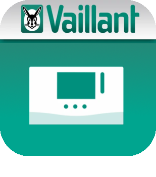

# Changelog

## MyVaillant - Plugin pour Jeedom (intégration des équipements Vaillant/Saunier-Duval pilotés par myVAILLANT ou MiGo Link)

* Installation du plugin [MyVaillant](https://limad.github.io/plugins-docs/plugin-MyVaillant/fr_FR/#tocAnchor-1-3).
* Topic dédié au plugin sur le [forum Jeedom](https://community.jeedom.com/search?q=MyVaillant&order=latest).
* [Documentation du plugin](https://limad.github.io/plugins-docs/plugin-MyVaillant/).

### Liste des évolutions majeures de la version courante

>*Liste non-exhaustive. Les changements mineurs et/ou corrections de bugs ne figurent pas forcément ici.*

### Version 13/07/2026

* Nouvelle vue **Consommations** sur l'équipement Home : conso électrique/gaz/environnementale par usage, COP et tendance sur 12 mois, corrélation COP/température extérieure, codes défaut, téléchargement du rapport annuel.
* Suivi automatique du **COP glissant** (calcul horaire), avec modèle de scénario d'alerte fourni.
* Nouvelles actions selon votre matériel : boost/désactivation ventilation, courbe de chauffe et limites par circuit.
* Nouveau bouton **Synchroniser sans reconnexion**, plus fiable en cas de coupure temporaire (n'échoue plus en forçant une reconnexion complète risquée).
* Traduction complète du plugin en **anglais, allemand et espagnol** (en plus du français).
* Corrections de fiabilité de la synchronisation et de bugs d'affichage (mode chauffage/refroidissement, codes défaut désormais bien rattachés à l'équipement).
* Audit sécurité et qualité du code.

### Version 16/12/2023

* Bug-Fix Commandes "action".
* Bug-Fix Commandes "info" consommations.
* Optimisations diverses (erreurs, logs...).

### Version 09/04/2023

* Version Beta.
