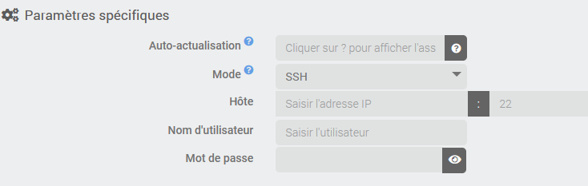

# Description

Plugin pour monitorer fail2ban. Il permet de remonter toutes les infos instantanées d'une instance de fail2ban locale ou distante (via SSH) mais il garde également des compteurs journaliers des IP bloquées ainsi qu'un compteur par pays d'origine de l'adresse IP (pays récupéré par géolocalisation de l'adresse IP).

Il permet également de bannir et de débannir une adresse ip.

> **Important**
>
> Ce plugin ne permet pas d'installer ni de configurer fail2ban sur le système.

# Versions supportées

| Composant | Version                     |
|-----------|-----------------------------|
| Debian    | Bullseye(11) & Bookworm(12) |
| Jeedom    | >= 4.5                      |

# Installation

Afin d’utiliser le plugin, vous devez le télécharger, l’installer et l’activer comme tout plugin Jeedom.

# Configuration du plugin

Une seule option est disponible: **Désactiver la géolocalisation des IP bannies**. Par défaut, chaque nouvelle IP publique bannie est envoyée à [ip-api.com](https://ip-api.com) (service tiers, interrogé en HTTP non chiffré car l'offre gratuite ne propose pas HTTPS) pour connaître son pays et alimenter les compteurs par pays. Si vous préférez qu'aucune adresse IP ne quitte votre installation, cochez cette option: les compteurs par pays ne seront alors plus mis à jour.

Le plugin utilise le cron Jeedom pour actualiser les équipements (voir configuration des équipements) et le cronDaily pour réinitialiser les compteurs journaliers.

# Les équipements

Chaque équipement du plugin correspondra à une instance de fail2ban sur une machine. Donc vous devez commencer par ajouter un équipement et donner un nom.

Dans la configuration de l'équipement, vous verrez les paramètres habituels commun à tous les équipements Jeedom et en dessous les paramètres spécifiques à ce plugin:

La première chose est de choisir le mode: *local* ou *SSH*. Le mode *local* permet de récupérer les informations de fail2ban installé sur la machine Jeedom alors que le mode *SSH* permet de se connecter sur une machine distante via SSH. Dans ce cas il faut saisir le nom d'hôte (ou l'adresse IP), le port (si différent que 22), le nom d'utilisateur (qui doit être dans le groupe sudoers) et son mot de passe.

## Authentification SSH

Deux modes d'authentification sont possibles pour le mode *SSH*:

- **Mot de passe**: simple mais moins sûr.
- **Clé privée** (recommandé): collez le contenu de la clé privée (formats OpenSSH/PEM: RSA, ECDSA, Ed25519) et, si elle en a une, sa passphrase. La clé publique correspondante doit figurer dans `~/.ssh/authorized_keys` de l'utilisateur sur la machine distante.

Dans les deux cas, l'utilisateur doit pouvoir lancer `fail2ban-client` avec `sudo` sans mot de passe (`NOPASSWD`), ou être *root*. Le mot de passe, la clé privée et la passphrase sont stockés chiffrés.

## Tester la connexion

Le bouton **Tester la connexion** (après avoir sauvegardé l'équipement) vérifie que fail2ban répond, en local ou via SSH, et indique le nombre de jails trouvés. En cas d'échec le message précise la cause probable (fail2ban absent, `sudo` qui demande un mot de passe, authentification refusée...). Le bouton **Actualiser maintenant** relit immédiatement tous les jails et crée les commandes des jails ajoutés depuis.

# La page du plugin

Sur la page du plugin, les équipements sont regroupés dans des panneaux repliables selon leur mode (*Local*, *SSH*). Chaque carte indique en vue tableau l'hôte, le nombre de jails et le nombre d'IP actuellement bannies.

La barre **Gestion** propose notamment:

- **Santé**: une fenêtre qui affiche, pour chaque équipement, l'état de chaque jail (échecs, bannissements, dernière IP bannie) et les compteurs par pays. Les valeurs se mettent à jour en direct. Depuis cette fenêtre vous pouvez actualiser un jail, bannir une adresse IP (bouton orange) et débannir une IP en cliquant sur le cadenas de sa pastille.
- **Assistance**: ouvre une demande d'aide pré-remplie sur le forum, avec un diagnostic du plugin.

Dans l'onglet **Commandes** d'un équipement, le bouton **Mode édition** (en haut à droite) bascule entre un affichage compact et un affichage détaillé qui permet d'ajuster l'unité, le min/max, la visibilité et l'historisation. Le type de commande est repéré par la couleur du bord de la ligne: bleu pour une info, orange pour une action.

Le bouton orange **Défaut config** (dans la barre d'outils de l'équipement) recrée les commandes manquantes, par exemple après une suppression par erreur, y compris hors connexion à la cible. Il réapplique aussi aux commandes existantes le widget iso et le type générique par défaut. Le widget n'est remplacé que s'il s'agit du widget par défaut, de l'ancien widget *line* ou d'un widget qui n'existe pas (plugin désinstallé, par exemple): un autre widget existant que vous avez choisi est conservé. Le type générique n'est renseigné que s'il est vide.

En mode *SSH*, le plugin enregistre l'empreinte de la clé du serveur lors de la première connexion, puis la vérifie à chaque connexion. Si elle change (serveur réinstallé, ou serveur qui usurpe l'identité de la cible), la connexion est refusée avant l'envoi du mot de passe ou de la clé privée. Après une réinstallation légitime, le bouton *Réinitialiser* à côté de l'empreinte permet de la réapprendre. Changer l'hôte ou le port la réinitialise aussi.

Vous pouvez également paramétrer à quelle fréquence les données doivent être actualisées, par défaut cela sera chaque 10 min. À chaque actualisation, le plugin recherche aussi les nouveaux jails et crée leurs commandes. Si un jail n'existe plus sur la cible, ses commandes sont masquées (l'historique est conservé), il n'est plus actualisé et un message est ajouté au centre de messages; si le jail réapparaît, ses commandes redeviennent visibles.

# Les commandes

Après la sauvegarde de l'équipement, si la configuration est correcte et que l'équipement est activé, le plugin va récupérer la liste des *jails* configurées et pour chacune il va créer les commandes suivantes:

- **Rafraichir** commande action pour actualiser les compteurs correspondant
- **Banip** commande action/message pour bannir l'IP donnée en message
- **Unbanip** commande action/message pour annuler le bannissement l'IP donnée en message
- **Echec actuel** info donnant le nombre de tentative en échec actuellement
- **Echec total** info donnant le nombre de tentative en échec au total
- **Banni** info donnant le nombre d'IP bannie actuellement
- **Total banni** info donnant le nombre d'IP bannie au total
- **Dernière IP bannie** info donnant la dernière IP bannie
- **Liste des IP bannies** info donnant la liste des ips bannies actuellement
- **Liste des IP bannies sur la journée** info donnant la liste des ips bannies sur la journée

Toutes les commandes utilisent par défaut un widget du jeu de widgets iso (installé automatiquement avec le plugin; sans lui, Jeedom affiche le widget par défaut): *iso_line* pour les infos (compteurs, listes d'IP, dernière IP, **En ligne**), *iso_btn* pour **Rafraichir**, **Banip** et **Unbanip**. Le nom des commandes créées suit la langue de Jeedom. La commande **Banip** est liée à l'info **Dernière IP bannie** du même jail et **Unbanip** à l'info **Liste des IP bannies** (commande info liée); **Rafraichir** n'est liée à aucune info, car il met à jour tous les compteurs à la fois. Dans l'onglet **Commandes**, la colonne *Etat* affiche cette info liée pour les actions; en *Mode édition*, une liste permet de la changer ou de la retirer.

Chaque équipement dispose aussi d'une commande info binaire **En ligne**: elle vaut 1 quand fail2ban a répondu lors de la dernière actualisation et 0 sinon (cible injoignable, authentification refusée, clé SSH modifiée, sudo refusé...). Elle permet de déclencher une alerte dans un scénario.

En plus de ces commandes, lors de chaque actualisation, si une nouvelle IP est bannie, le plugin fera une recherche de géolocalisation de l'adresse IP et créera une nouvelle commande par pays d'origine contenant le nombre de visite distincte (par adresse IP) (uniquement pour les adresses IP publiques)

# Changelog

[Voir le changelog](./changelog)

# Support

Si vous avez un problème, commencez par lire les derniers sujets en rapport avec le plugin sur [community]({{site.forum}}/tag/plugin-{{page.pluginId}}).

Si malgré tout vous ne trouvez pas de réponse à votre question, n'hésitez pas à créer un nouveau sujet en n'oubliant pas de mettre le tag du plugin ([plugin-{{page.pluginId}}]({{site.forum}}/tag/plugin-{{page.pluginId}})).

Il faudra au minimum fournir:

- une capture d'écran de la page santé Jeedom
- une capture d'écran de la page de config du plugin
- tous les logs disponibles du plugin, en niveau *INFO*, collés dans un `Texte préformaté` (bouton `</>` sur community), pas de fichiers!
- selon les cas, une capture d'écran de l'erreur rencontrée, une capture d'écran de la configuration posant problème...

---

*f2ban — Documentation | Plugin open-source pour Jeedom*
