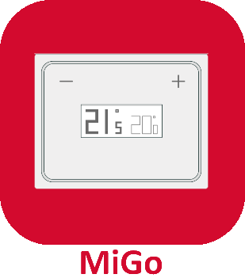

# MigoThermostat - Plugin pour Jeedom

* Installation du thermostat [MigoThermostat.](https://limad.github.io/plugin-migoThermostat/fr_FR/#tocAnchor-1-3)
* Topic dedié du thermostat [MigoThermostat.](https://www.jeedom.com/forum/viewtopic.php?p=764669#p764669)
* [Documentation](index.md).

## Changelog
>*Liste non-exhaustive. Les changements mineurs et/ou correction de bugs ne figurent pas forcément ici.*
### 09/10/2020
* ajout d'une commande info "Etat-Ecs"
* adaptation de la nouvelle commande sur tuile(dashboard)
* correction et amélioration des tuiles(dashboard) pour s'adapter aux différends thèmes
* ...
### 15/03/2020
!! Arrêt du support pour le plugin en Jeedom V3
Donc pour Jeedom V4:
* optimisations diverses (errors logs,...)
* correction et amelioration des tuiles(dashboard, mobile)
  - icone(anticipation, status de chauffe)
  - lien vers le panel
  - signalement et affichage des alertes "error" sur la tuile.
* ...
### 22/09/2019
* Mise en conformité pour PHP-7.3(Buster)
* séparation tuile V3/V4
* correction bug (graphiques depuis la tuile)
* optimisations diverses
### 14/09/2019
* Mise en conformité pour Jeedom V4
* refonte de la tuile "dashboard" (correction de bugs, conformité V4, optimisation du code...)
* remise en service du panel.
* correction de bugs mineurs.
* Passage de la beta sur Jeedom V4

>   *Pour Jeedom V3, rester dorénavant en version Stable. Le market sélectionne automatique la stable V3 ou V4 en fonction de votre version de Jeedom.*
