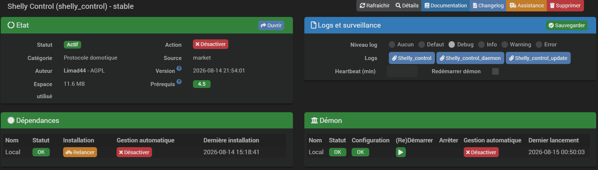
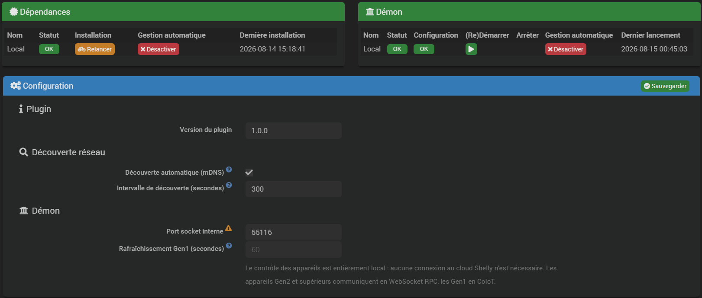
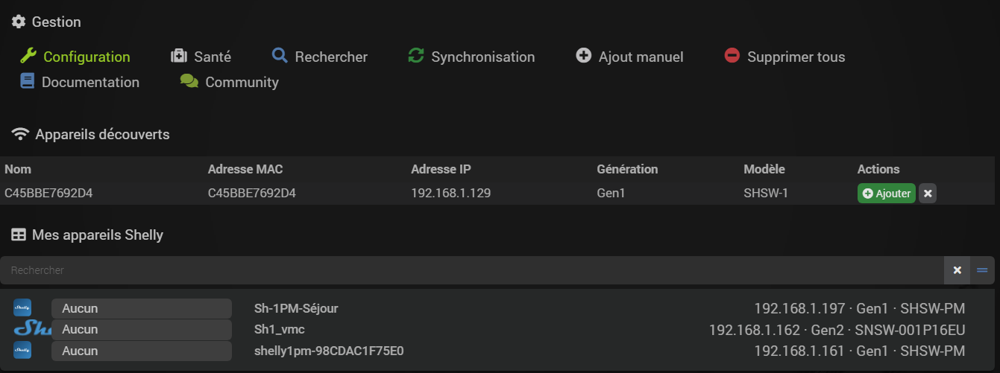
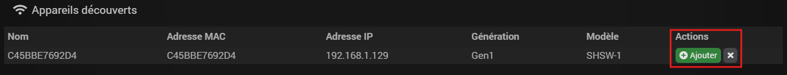
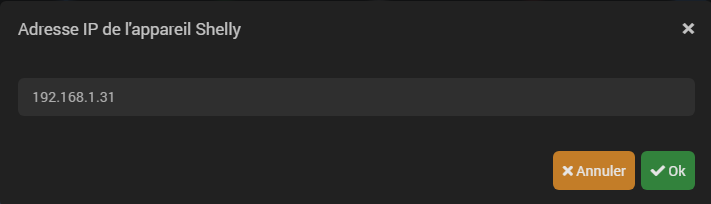
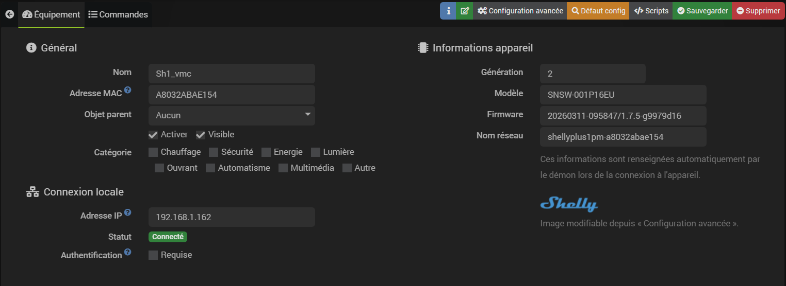
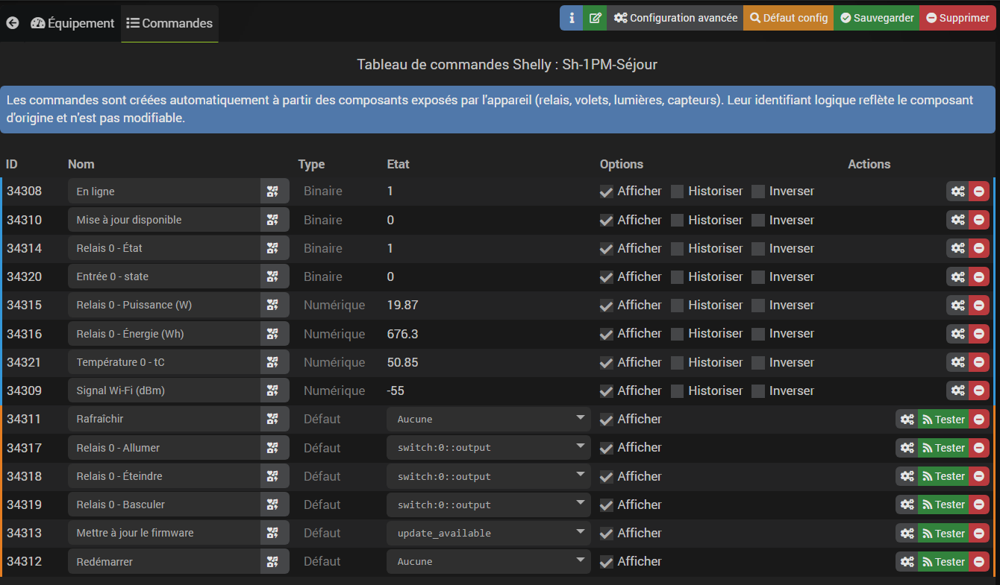
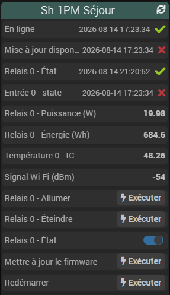
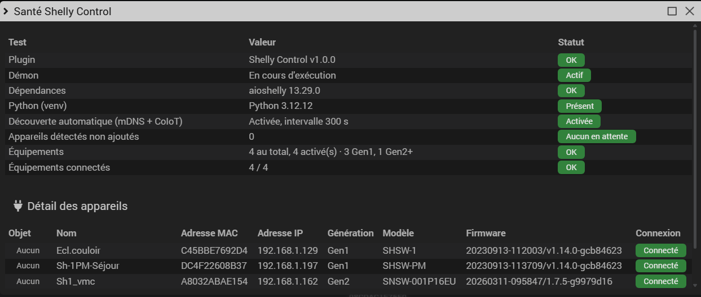
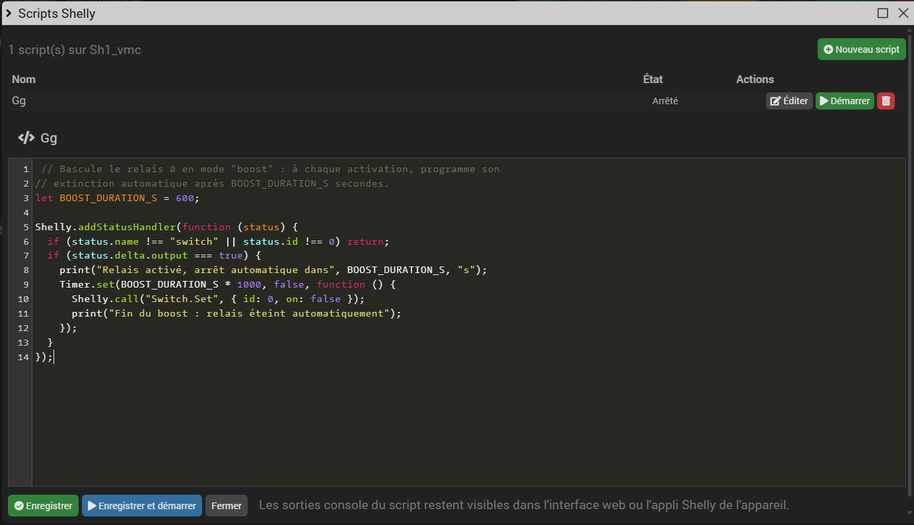

# Présentation

**Shelly Control** permet de piloter les appareils **Shelly** (relais, volets, lumières, capteurs)
**en local, sans passer par le cloud Shelly**. La communication se fait directement sur le réseau
local avec chaque appareil :

- **CoIoT / HTTP** pour les appareils **Gen1**,
- **WebSocket RPC** pour les appareils **Gen2, Gen3 et Gen4**.

Les appareils présents sur le réseau sont détectés automatiquement par **découverte mDNS**, sans
configuration manuelle de leur adresse IP.

>**INFORMATION**
>
>Aucun compte Shelly Cloud, aucune clé API externe et aucune connexion Internet ne sont
>nécessaires : tout le contrôle transite en direct entre Jeedom et l'appareil, sur le réseau
>local.

## Fonctionnement général

Le plugin s'appuie sur un **démon Python** (bibliothèque `aioshelly`) qui maintient une connexion
permanente à chaque appareil ajouté :

- il reçoit en temps réel les changements d'état (relais actionné physiquement, volet en
  mouvement, capteur qui remonte une nouvelle valeur…) et les répercute immédiatement dans
  Jeedom ;
- il exécute les commandes envoyées depuis Jeedom (allumer, éteindre, ouvrir un volet, régler une
  couleur…) ;
- il scanne périodiquement le réseau local en mDNS pour découvrir les nouveaux appareils Shelly.

Les **commandes Jeedom sont créées automatiquement** à partir des composants réellement exposés
par l'appareil (un relais n'aura pas les mêmes commandes qu'un volet ou qu'une lumière RGB) : il
n'y a rien à créer manuellement.

## Compatibilité

- Appareils Shelly **Gen1** (CoIoT), **Gen2**, **Gen3** et **Gen4** (WebSocket RPC).
- Relais (switch), volets/stores (cover), lumières (blanches, RGB, RGBW, blanc réglable CCT),
  entrées, capteurs (température, humidité, alimentation, compteur d'énergie, fumée, mouvement,
  luminosité…).
- Les composants non reconnus spécifiquement par le plugin remontent tout de même en Jeedom sous
  forme de commandes d'information génériques : aucune valeur exposée par l'appareil n'est perdue.

### Exigences

- **Wi-Fi** : l'appareil doit être connecté au réseau Wi-Fi local (2,4 GHz) et joignable en IP
  depuis le serveur Jeedom — même réseau ou routage IP vers celui-ci. Un appareil accessible
  uniquement en Bluetooth n'est pas compatible (voir plus bas).
- **Gen1** : port UDP **5683** (CoIoT, multicast local) ouvert pour la remontée d'état en temps
  réel. Sans lui, l'appareil reste pilotable mais son état n'est rafraîchi que périodiquement
  (repli HTTP, voir réglage **Rafraîchissement Gen1** plus bas).
  >**ATTENTION**
  >
  >CoIoT peut aussi être désactivé — ou redirigé vers un autre destinataire — **directement dans
  >les paramètres de l'appareil** (page **Internet & Security** de son interface web, section
  >**COIOT**), indépendamment de tout réglage réseau. Dans ce cas l'état reste lui aussi limité au
  >rafraîchissement périodique, et le plugin affiche un message d'avertissement sur la page de
  >gestion pour le signaler.
- **Gen2/Gen3/Gen4** : connexion WebSocket sortante autorisée entre le démon et l'appareil (port
  HTTP standard de l'appareil, 80 par défaut).
- **Découverte mDNS** : le serveur Jeedom et les appareils Shelly doivent être sur un réseau qui
  laisse passer le multicast mDNS (pas de VLAN cloisonné entre eux) pour que la découverte
  automatique fonctionne ; sans cela, l'ajout reste possible manuellement par adresse IP.
- Aucun compte Shelly Cloud n'est nécessaire ni utilisé : un appareil dont une fonctionnalité
  dépendrait exclusivement du cloud Shelly (et non de son API locale) serait hors périmètre du
  plugin, par principe — aucun cas de ce type n'existe à ce jour dans la gamme Shelly.

### Ce qui n'est pas géré

- **Appareils Bluetooth uniquement (gamme BLU)** — BLU Button1, BLU Door/Window, BLU H&T, BLU
  Motion, BLU TRV, BLU RC Button, BLU Wall Switch… Ces capteurs ne parlent ni CoIoT ni WebSocket
  RPC : ils passent par un **BLU Gateway** (lui-même un appareil Wi-Fi Gen2/Gen3, détecté
  normalement). Le plugin ne relaie toutefois pas les appareils BLE rattachés à cette passerelle
  vers Jeedom — seule la passerelle elle-même apparaît comme équipement.
  >**ASTUCE**
  >
  >Ne pas confondre avec le **Shelly H&T Gen3** ou le **Shelly Plus H&T** : ce sont des capteurs
  >**Wi-Fi** (pas Bluetooth), pleinement compatibles — y compris leur cycle veille/réveil sur
  >batterie, déjà géré par le démon.
- **Blaster infrarouge du Shelly Sense** — émission de codes IR, bibliothèque de codes stockés,
  programmation hebdomadaire (`/ir`, `/ir/add`, `/ir/list`, `/ir/emit`) : non implémenté. Ses
  capteurs (température, humidité, mouvement, luminosité, batterie) sont en revanche remontés
  normalement.
- **Shelly 4Pro et Shelly Sense** — ces deux appareils utilisent un dialecte CoIoT plus ancien
  (v1) que celui du reste de la gamme Gen1 (v2) : pas de remontée d'état en temps réel, seulement
  un rafraîchissement périodique (même repli HTTP que ci-dessus). Le pilotage (relais, capteurs)
  fonctionne normalement par ailleurs.
- **Appareils absents du catalogue de la bibliothèque `aioshelly`** utilisée par le démon (modèle
  trop récent pas encore référencé, ou trop ancien/rare) : comportement non garanti, à tester au
  cas par cas.

# Installation

Comme tout plugin Jeedom, **Shelly Control** doit être installé puis activé.

L'installation met en place un environnement Python dédié (venv) contenant la bibliothèque
`aioshelly` : c'est cette dépendance qui est vérifiée sur la page de gestion du plugin
(bloc **Dépendances**). Si elle n'est pas au vert, cliquez sur **Relancer** pour relancer son
installation.



Une fois les dépendances en place, le **démon** doit être démarré (bloc **Démon**, bouton
**(Re)Démarrer**) : c'est lui qui communique avec les appareils Shelly. Sans démon actif, aucune
découverte ni aucune commande n'est possible.

# Configuration du plugin

La configuration générale se trouve dans **Plugins → Protocole domotique → Shelly Control →
Configuration**, ou directement depuis le bandeau de gestion du plugin (bouton
**Configuration**, icône clé à molette, sur la page principale du plugin).



- **Découverte automatique (mDNS)** : active le scan périodique du réseau local à la recherche de
  nouveaux appareils Shelly. **Désactivée par défaut** — un ajout se fait normalement via le
  bouton **Rechercher** (scan ponctuel) sur la page du plugin ; n'activer le scan périodique que
  si de nouveaux appareils Shelly sont ajoutés régulièrement au réseau.
- **Intervalle de découverte (secondes)** : fréquence des scans mDNS quand la découverte
  automatique est activée. Minimum 60 secondes, valeur par défaut 600 secondes (10 minutes).
- **Port socket interne** : port TCP local (`127.0.0.1` uniquement, jamais exposé sur le réseau)
  utilisé pour la communication entre Jeedom et le démon. Valeur par défaut `55116`.
  >**IMPORTANT**
  >
  >Le démon doit être **redémarré manuellement** après toute modification de ce port (bloc
  >**Démon** de la page de gestion du plugin).
- **Rafraîchissement Gen1 (secondes)** : les appareils Gen1 communiquent leurs changements d'état
  en CoIoT (multicast), qui peut occasionnellement manquer une notification. Ce cycle HTTP
  complémentaire interroge périodiquement chaque appareil Gen1 pour rattraper un état manqué et
  détecter sa perte de connexion. Minimum 30 secondes, valeur par défaut 60 secondes. Sans effet
  sur les appareils Gen2 et supérieurs, qui utilisent une connexion WebSocket permanente.

# Ajout des appareils

La page principale du plugin (**Plugins → Protocole domotique → Shelly Control**) centralise la
découverte et la gestion des appareils.



Le bandeau **Gestion** en haut de page donne accès à :

- **Configuration** : réglages généraux du plugin (voir plus haut) ;
- **Santé** : diagnostic complet de l'installation (voir plus bas) ;
- **Rechercher** : force un scan mDNS immédiat sans attendre le prochain cycle automatique ;
- **Synchronisation** : resynchronise l'état de tous les appareils déjà ajoutés (utile après un
  redémarrage du démon, par exemple) ;
- **Ajout manuel** : ajoute un appareil par son adresse IP quand la découverte mDNS ne le trouve
  pas (réseau segmenté, mDNS bloqué…) ;
- **Supprimer tous** : supprime en une fois tous les équipements Shelly de Jeedom ;
- **Documentation** / **Community** : liens vers la documentation en ligne et le forum Jeedom.

## Découverte automatique

Tant que le démon tourne, les appareils Shelly présents sur le réseau local apparaissent
automatiquement dans le bloc **Appareils découverts**, avec leur nom, adresse MAC, adresse IP,
génération et modèle.



Pour chaque appareil détecté :

- **Ajouter** crée l'équipement Jeedom correspondant et génère ses commandes ;
- l'icône **✕** l'ignore : il disparaît de la liste des appareils en attente (il réapparaîtra si
  jamais il est de nouveau détecté après un redémarrage du démon).

## Ajout manuel

Si un appareil n'est pas détecté par mDNS (segment réseau différent, mDNS filtré par un
équipement réseau…), utilisez le bouton **Ajout manuel** du bandeau **Gestion** : il suffit de
renseigner son **adresse IP**, puis son **adresse MAC** (12 caractères hexadécimaux, visible dans
l'interface web de l'appareil ou son étiquette).



# Configuration des équipements

Cliquer sur un appareil dans la liste ouvre sa fiche, avec deux onglets : **Équipement** et
**Commandes**.

## Onglet Équipement



**Général**

- **Nom** : nom de l'équipement dans Jeedom.
- **Adresse MAC** : identifiant unique de l'appareil, renseigné automatiquement à la création et
  non modifiable ensuite.
- **Objet parent**, **Activer**, **Visible**, **Catégorie** : réglages standards Jeedom.

**Connexion locale**

- **Adresse IP** : adresse de l'appareil sur le réseau local. Mise à jour automatiquement si elle
  change (attribution DHCP) tant que l'appareil reste joignable en mDNS.
- **Statut** : état de connexion en temps réel de l'appareil (connecté / déconnecté / erreur),
  rafraîchi automatiquement toutes les 5 secondes pendant la consultation de la fiche.
- **Authentification** : à activer uniquement si une restriction d'accès a été configurée
  directement sur l'appareil Shelly (interface locale). Une fois activée, elle fait apparaître
  les champs **Utilisateur** et **Mot de passe**.
  >**INFORMATION**
  >
  >Le mot de passe est stocké chiffré par Jeedom (comme tout champ de mot de passe du core) et
  >n'apparaît jamais en clair dans les logs.

**Informations appareil**

Génération, modèle, version de firmware et nom réseau sont renseignés automatiquement par le
démon lors de la connexion à l'appareil — ils ne sont pas modifiables manuellement. Une image de
l'appareil est également affichée ; elle peut être remplacée par une image personnalisée depuis
**Configuration avancée** (bouton en haut de la fiche équipement).

## Onglet Commandes



Les commandes sont **entièrement générées à partir des composants réellement exposés par
l'appareil** : leur nombre et leur nature varient donc d'un modèle à l'autre. Leur identifiant
logique reflète le composant d'origine et n'est pas modifiable.

Chaque appareil dispose au minimum des commandes communes suivantes :

- **En ligne** *(info, binaire)* : reflète l'état de connexion de l'appareil.
- **Signal Wi-Fi (dBm)** *(info, numérique)*.
- **Mise à jour disponible** *(info, binaire)* et **Mettre à jour le firmware** *(action)*.
- **Rafraîchir** *(action)* : force une resynchronisation immédiate de l'état de l'appareil.
- **Redémarrer** *(action)* : redémarre l'appareil.

S'y ajoutent les commandes propres à chaque composant détecté, par exemple :

- **Relais** (switch) : état, puissance (W), tension (V), courant (A), température, énergie
  cumulée (Wh) ; actions Allumer / Éteindre / Basculer.
- **Volet** (cover) : état, position (%), puissance (W) ; actions Ouvrir / Fermer / Stop / Régler
  la position (curseur).
- **Lumière** (blanche simple, RGB, RGBW, blanc réglable CCT) : état, luminosité, couleur, canal
  blanc et/ou température de couleur selon les capacités du modèle ; actions correspondantes
  (Allumer / Éteindre / Basculer, curseur de luminosité, sélecteur de couleur…).
- **Capteurs** (température, humidité, alimentation, compteur d'énergie, fumée…) et tout autre
  composant non modélisé spécifiquement : chaque valeur remontée par l'appareil devient une
  commande d'information dédiée.

>**INFORMATION**
>
>Quand une commande action agit sur un état (allumer/éteindre, ouvrir/fermer…), son champ
>**Etat** est automatiquement lié à la commande info correspondante : c'est ce qui permet
>d'afficher l'état courant directement sur le bouton, comme pour la majorité des plugins Jeedom.

## Résumé sur le tableau de bord

Comme toute commande Jeedom, celles créées par le plugin peuvent être affichées sous forme de
résumé compact (widget « summary ») sur un tableau de bord ou un objet :



# Vue « Panel »

En plus de la page de gestion classique, le plugin expose une vue compacte façon application
mobile : une grille de cartes, une par appareil, avec photo du modèle, pastille de statut de
connexion et un contrôle rapide (bascule pour un relais/lumière, ou boutons Ouvrir / Stop /
Fermer pour un volet). Elle ne remplace pas la page de gestion — elle s'y ajoute, pour une
consultation et un pilotage plus rapides au quotidien.


Pour y accéder, activer la case **Afficher le panneau desktop** dans la page de gestion du
plugin (menu **Plugins → Gestion des plugins → Shelly Control**), ou naviguer directement vers
`index.php?v=d&m=shelly_control&p=panel`. L'entrée de menu **Shelly Control** apparaît alors dans
la catégorie **Panel** du menu principal, à côté des autres plugins qui proposent cette vue.

- Cliquer sur la photo ou le nom d'un appareil ouvre la page de gestion classique.
- Le contrôle rapide agit immédiatement sur l'appareil (même mécanisme que n'importe quel widget
  de tableau de bord Jeedom) et se resynchronise en direct si l'état change ailleurs (application
  Shelly, autre onglet Jeedom…).
- Un appareil purement capteur (sans relais, volet ni lumière) n'affiche pas de contrôle : juste
  sa photo, son nom et son statut de connexion.

# Diagnostic (Santé)

Le bouton **Santé** du bandeau **Gestion** ouvre une modale de diagnostic complet de
l'installation : état du plugin, du démon, des dépendances Python (venv, version d'`aioshelly`),
de la découverte automatique, nombre d'appareils détectés en attente, nombre d'équipements
(total, activés, Gen1/Gen2+) et nombre d'équipements réellement connectés. Le détail de chaque
appareil (objet, nom, MAC, IP, génération, modèle, firmware, statut de connexion) est listé
en dessous, ainsi que les appareils détectés en attente d'ajout le cas échéant.



C'est le premier réflexe en cas de souci : appareil qui n'apparaît pas, commandes qui ne
remontent pas d'état, etc.

## Diagnostic réseau

Le bouton **Diagnostic** du bandeau **Gestion** ouvre une page distincte, complémentaire à la
modale Santé : elle interroge **directement l'appareil en HTTP, en dehors de Jeedom**, sur
plusieurs endpoints connus (identification, état, configuration), et affiche les réponses brutes
sous forme de JSON — avec des boutons **Copier** et **Télécharger** pour le transmettre facilement
au support.

Utile pour distinguer un problème côté Jeedom/démon d'un problème côté appareil (injoignable,
authentification bloquante, firmware qui ne répond pas comme attendu…) : il suffit de renseigner
son adresse IP, sans que l'appareil ait besoin d'être déjà ajouté au plugin.

# Problèmes connus

**Le nom de l'équipement ne correspond pas au nom donné à l'appareil**

Le nom d'un appareil n'est lu par le démon **qu'au moment de la connexion** (démarrage du démon,
reconnexion après coupure…), jamais republié ensuite tant que la connexion reste active. Deux
causes possibles :

- Le nom n'a en réalité jamais été enregistré comme **nom d'appareil** sur le Shelly lui-même —
  vérifier, dans l'interface web ou l'application de l'appareil, que le champ **Device name**
  (ou **Nom de l'appareil**) est bien renseigné : un intitulé visible uniquement dans une pièce ou
  une liste de l'application n'est pas forcément enregistré sur l'appareil.
- Le nom a bien été changé sur l'appareil, mais **après** la dernière connexion du démon à
  celui-ci — le nouveau nom ne remonte donc pas tout seul.

Dans les deux cas, forcer une resynchronisation règle le problème une fois le nom bien réglé sur
l'appareil :

- bouton **Métadonnées** sur la fiche d'un équipement précis (force sa reconnexion) ;
- ou bouton **Synchronisation** du bandeau **Gestion**, qui le fait pour tous les équipements en
  une fois.

**Les mises à jour d'état Gen1 ne sont plus instantanées**

Un appareil Gen1 pousse normalement ses changements d'état en temps réel via **CoIoT**
(multicast UDP) ; sans lui, le plugin se replie sur un rafraîchissement HTTP périodique (réglage
**Rafraîchissement Gen1**, 60 secondes par défaut) — perceptible comme un délai. Causes
possibles :

- **CoIoT désactivé ou redirigé directement dans les paramètres de l'appareil** (page
  **Internet & Security**, section **COIOT**) — voir l'encart dans la section **Compatibilité**
  ci-dessus. Le plugin affiche désormais un message d'avertissement sur la page de gestion quand
  c'est le cas.
- Multicast bloqué entre l'appareil et Jeedom (VLAN sans reflecteur multicast, pare-feu, switch
  avec IGMP snooping mal configuré).
- Port UDP **5683** (CoAP) déjà utilisé par un autre service sur le serveur Jeedom (une autre
  passerelle domotique communiquant elle aussi en CoIoT/CoAP, par exemple) : le démon logue alors
  une erreur au démarrage et ne recevra aucune mise à jour poussée, pour aucun appareil Gen1.
- Modèle à dialecte CoAP trop ancien (**Shelly 4Pro**, **Shelly Sense**) — voir section
  **Ce qui n'est pas géré** : le repli périodique est alors le fonctionnement normal, pas une
  panne.

# Scripts natifs (Gen2+)

Les appareils **Gen2, Gen3 et Gen4** embarquent un moteur de script JavaScript natif (absent des
appareils Gen1). Le bouton **Scripts** de la fiche équipement — visible uniquement pour ces
générations — ouvre un éditeur permettant de :

- lister les scripts présents sur l'appareil et leur état (en cours / arrêté) ;
- créer un nouveau script ;
- éditer le code d'un script existant (éditeur CodeMirror, coloration JavaScript) ;
- l'enregistrer, ou l'enregistrer et le démarrer directement ;
- démarrer, arrêter ou supprimer un script.



>**INFORMATION**
>
>Les sorties console (`print()`) d'un script restent visibles depuis l'interface web native de
>l'appareil ou l'application Shelly, pas depuis Jeedom.

## Exemple : mode « boost » temporisé

Un script natif s'exécute directement sur l'appareil, indépendamment de Jeedom : utile pour des
automatismes qui doivent continuer à fonctionner même si le démon ou Jeedom est éteint. Exemple
pour un relais de VMC : l'activer bascule automatiquement le relais 0 en mode « boost », qui
s'éteint tout seul après un délai fixe.

```js
// Bascule le relais 0 en mode "boost" : à chaque activation, programme son
// extinction automatique après BOOST_DURATION_S secondes.
let BOOST_DURATION_S = 600;

Shelly.addStatusHandler(function (status) {
  if (status.name !== "switch" || status.id !== 0) return;
  if (status.delta.output === true) {
    print("Relais activé, arrêt automatique dans", BOOST_DURATION_S, "s");
    Timer.set(BOOST_DURATION_S * 1000, false, function () {
      Shelly.call("Switch.Set", { id: 0, on: false });
      print("Fin du boost : relais éteint automatiquement");
    });
  }
});
```

# Webhooks (URLs d'action)

Tous les appareils Shelly savent appeler eux-mêmes une URL quand un événement se produit (appui
sur un bouton, changement d'état d'un relais, franchissement d'un seuil de mesure…). Le bouton
**Webhooks** de la fiche équipement permet de lister et de modifier ces URLs directement, sans
passer par l'interface web de l'appareil.

## À quoi ça sert vraiment

Il est tentant de voir un webhook comme « le tuyau qui fait remonter les appuis vers Jeedom ».
C'est un usage, mais c'est le plus réducteur. Un webhook fait de l'appareil Shelly un **client HTTP
autonome** : à chaque changement d'état de ses entrées ou de ses sorties, il émet lui-même une
requête vers l'adresse de votre choix. Jeedom n'est qu'une destination possible.

Trois propriétés en découlent, et ce sont elles qui font l'intérêt du mécanisme :

- **Latence minimale** — la requête part de l'appareil vers sa cible, directement sur le réseau
  local. Ni cloud Shelly, ni détour par la box, ni scénario à évaluer.
- **Indépendance** — l'automatisme ne dépend ni de votre connexion internet, ni de Jeedom. Il
  continue de fonctionner pendant une mise à jour de la box, un redémarrage, ou une panne.
- **Universalité** — toute cible capable de recevoir une requête HTTP convient, sans intégration
  spécifique de part et d'autre.

Concrètement, quatre rôles bien distincts :

| Rôle | Destination de l'URL | Ce que ça apporte |
| --- | --- | --- |
| **Association directe** (pair-à-pair) | un autre appareil Shelly | Un interrupteur pilote une lampe à l'autre bout du logement, sans intermédiaire. Survit à l'arrêt de Jeedom **et** à la coupure d'internet. |
| **Remontée d'événement** | Jeedom (ou une autre box) | Déclenche un scénario complexe. **Seul rôle où un Gen1 n'a aucune alternative** : voir la section suivante. |
| **Notification externe** | IFTTT, Zapier, Slack… | Une alerte push sans passer par le cloud Shelly ni exposer vos appareils. |
| **Réaction sur sortie** | un autre appareil Shelly | Chaîner un état physique à un autre : le relais du vidéoprojecteur ferme les volets. |

## Exemples

**1. Association directe entre deux Shelly.** Un Shelly Plus 1 derrière l'interrupteur de l'entrée
doit allumer une lampe branchée sur un Shelly Plug au fond du salon.

- Sur l'interrupteur, événement : `input.button_push` (Gen2+) ou action `shortpush_url` (Gen1)
- URL : `http://192.168.1.50/relay/0?turn=on`
- La lampe s'allume en même temps que le plafonnier, sans intermédiaire.

**2. Appui long déclenchant un scénario Jeedom.** Un appui long lance le scénario « Départ de la
maison » (extinction générale, volets, alarme).

- Événement : `input.button_longpush` (Gen2+) ou action `longpush_url` (Gen1)
- URL : celle d'une commande virtuelle Jeedom (voir le tableau ci-dessous), ou plus simplement
  l'URL de rappel posée automatiquement par **Brancher les événements sur Jeedom** — le scénario se
  déclenche alors sur la valeur `long_push` de la commande « Appui ».

**3. Notification externe.** Recevoir une notification push dès qu'une porte s'ouvre.

- Événement : ouverture du capteur
- URL : le webhook fourni par IFTTT, Zapier ou Slack (`https://…`)
- Aucun compte Shelly Cloud impliqué, et Jeedom n'est pas dans la boucle.

**4. Réaction sur une sortie.** Le vidéoprojecteur est branché sur un Shelly Plug S ; les volets
sont motorisés par un Shelly 2PM. Allumer le projecteur doit faire le noir.

- Sur la prise, événement : `switch.on` (Gen2+) ou action `out_on_url` (Gen1)
- URL : `http://192.168.1.60/rpc/Cover.Close?id=0`
- Dès que le projecteur est alimenté, les volets se ferment.

### Formes d'URL utiles comme cible

| Cible | URL |
| --- | --- |
| Relais d'un Shelly Gen1 | `http://<ip>/relay/0?turn=on` (`off`, `toggle`) |
| Volet d'un Shelly Gen1 | `http://<ip>/roller/0?go=close` (`open`, `stop`) |
| Relais d'un Shelly Gen2+ | `http://<ip>/rpc/Switch.Set?id=0&on=true` |
| Volet d'un Shelly Gen2+ | `http://<ip>/rpc/Cover.Close?id=0` (`Cover.Open`, `Cover.Stop`) |
| Commande Jeedom | `http://<jeedom>/core/api/jeeApi.php?apikey=<clé API>&type=cmd&id=<id commande>` |
| Appui remonté par ce plugin | posée automatiquement par **Brancher les événements sur Jeedom** |

>**ASTUCE**
>
>L'`id` d'une commande Jeedom se lit dans la colonne **ID** du tableau de commandes de
>l'équipement, et la clé d'API dans **Réglages > Système > Configuration > API**. Une commande
>virtuelle sans autre rôle que d'être déclenchée par un Shelly est souvent la façon la plus lisible
>de faire le pont vers un scénario.

>**IMPORTANT**
>
>Ce plugin **édite** ces configurations, il ne les possède pas. Beaucoup de webhooks présents sur
>vos appareils n'auront rien à voir avec Jeedom, et doivent continuer à fonctionner exactement
>comme avant. C'est pourquoi les URLs existantes ne sont jamais écrasées (voir « Remonter les
>appuis d'un appareil Gen1 »), et pourquoi les restrictions Gen2+ qu'un webhook peut porter sont
>affichées telles quelles.

## Restrictions affichées sur les appareils Gen2 et supérieurs

Les webhooks Gen2+ sont plus riches que les actions Gen1 : en plus des URLs, ils acceptent une
plage horaire d'activation, une condition d'évaluation et un délai minimal entre deux
déclenchements. Ces réglages se configurent depuis l'interface web de l'appareil, pas depuis ce
plugin — mais ils sont **affichés** sur la carte du webhook, sous forme de pastilles :

| Pastille | Signification |
| --- | --- |
| 🕐 `08:00–20:00` | Le webhook ne se déclenche que dans cette plage horaire. |
| Condition | Une expression conditionne le déclenchement (survolez pour la lire). |
| ⏳ `30 s` | Délai minimal imposé entre deux déclenchements. |

Les afficher évite un faux diagnostic : sans elles, un webhook restreint à une plage horaire
paraîtrait inconditionnel, et son silence en dehors passerait pour une panne. Modifier les URLs ou
l'activation depuis ce plugin **préserve** ces réglages.

Le mécanisme diffère selon la génération, et la modale s'adapte :

- **Gen1** : les URLs vivent dans des **emplacements fixes** de la configuration, un par couple
  (action, canal) — `shortpush_url`, `longpush_url`, `btn_on_url`, `out_on_url`,
  `ext_temp_over_url`… Rien ne se crée ni ne se supprime : un emplacement est soit rempli, soit
  vide. Le bouton de suppression vide donc l'emplacement au lieu de le faire disparaître.
- **Gen2/Gen3/Gen4** : les webhooks sont des **objets à part entière**, créés et supprimés
  librement, avec un événement choisi dans la liste que l'appareil déclare lui-même
  (`input.button_push`, `switch.on`, `input.toggle_off`…). L'événement et le canal sont figés à la
  création — seuls le nom, les URLs et l'activation restent modifiables ensuite.

Chaque webhook accepte **plusieurs URLs**, une par ligne. L'appareil les appelle lui-même, en
direct, sans passer par le cloud Shelly.

## Remonter les appuis d'un appareil Gen1

C'est l'usage principal de cette page. Un appareil **Gen1 ne transmet jamais les appuis** sur ses
boutons ou entrées : le protocole CoIoT ne transporte que l'état des capteurs. Un webhook est le
seul moyen d'obtenir cette information — contrairement aux appareils Gen2 et supérieurs, qui la
poussent nativement au démon (notifications RPC) et n'ont donc rien à configurer ici.

Le bouton **Brancher les événements sur Jeedom**, visible uniquement sur les équipements Gen1,
s'occupe de tout : il écrit une URL de rappel dans chaque action d'entrée déclarée par l'appareil.
Au premier appui reçu, une commande info **« Appui »** apparaît par canal (`input:0::event`), avec
le même vocabulaire de valeurs que les appareils Gen2 et supérieurs :

| Action Gen1 | Valeur de la commande | Équivalent Gen2+ |
| --- | --- | --- |
| `shortpush_url` | `single_push` | appui court |
| `double_shortpush_url` | `double_push` | double appui |
| `triple_shortpush_url` | `triple_push` | triple appui |
| `longpush_url` | `long_push` | appui long |
| `btn_on_url` / `btn_off_url` | `btn_on` / `btn_off` | bascule de l'entrée |

Un même scénario peut ainsi réagir aux appuis d'un parc mixte Gen1/Gen2+ sans distinction.

>**INFORMATION**
>
>Un appareil déclare généralement les deux familles d'actions à la fois (`btn_on`/`btn_off` et
>`shortpush`/`longpush`) : celle qui se déclenche réellement dépend du mode configuré pour
>l'entrée (bascule ou impulsion). Toutes sont branchées, ce qui est sans effet de bord — seules
>les pertinentes seront jamais appelées.

>**IMPORTANT**
>
>L'adresse interne de Jeedom (**Réglages > Système > Configuration > Réseaux**) doit être une
>adresse joignable depuis le réseau local : c'est l'appareil Shelly qui appelle Jeedom, et non
>l'inverse. Une adresse en `127.0.0.1` est refusée, car l'URL écrite dans l'appareil
>n'atteindrait jamais Jeedom.

Le branchement est **non destructif** : les URLs déjà présentes sur un emplacement sont
conservées, une seule est ajoutée. C'est utile pour cohabiter avec une autre intégration, ou pour
migrer progressivement depuis un ancien plugin sans rien casser. **Débrancher les événements
Jeedom** fait l'inverse et ne retire que les URLs de rappel de ce plugin.

# Migration depuis l'ancien plugin Shelly

Pour les utilisateurs de l'ancien plugin communautaire **Shelly** (lunarok) qui basculent vers
**Shelly Control**, un bouton **Migration** apparaît dans le bandeau **Gestion** de la page
principale — **uniquement si l'ancien plugin `shelly` est installé et actif** sur la même
installation Jeedom. Il ouvre une modale qui recherche automatiquement, pour chaque équipement de
l'ancien plugin, l'équipement **Shelly Control** correspondant, puis propose de réécrire les
références (scénarios, vues, plans…) de l'un vers l'autre.

>**INFORMATION**
>
>Cette migration ne copie **ni le nom ni la configuration** des commandes : elle réécrit
>uniquement les références internes (`#id#`) qui pointent vers l'ancienne commande pour qu'elles
>pointent désormais vers la nouvelle. C'est le même mécanisme que le bouton natif Jeedom
>**« Cette commande remplace l'ID »**, disponible sur la configuration avancée de toute commande —
>ce bouton l'applique simplement en une fois, pour tout un parc d'appareils, au lieu de le faire
>commande par commande.

## Fonctionnement

1. **Correspondance des équipements** : l'ancien plugin identifie ses appareils par adresse IP, le
   nouveau par adresse MAC. La migration interroge donc directement chaque ancien équipement à son
   adresse IP enregistrée (endpoint `/shelly`, public même sur un appareil protégé par mot de
   passe) pour en obtenir la MAC, et retrouve l'équipement Shelly Control correspondant. Les
   **sous-relais virtuels** de l'ancien plugin (option « syncVirtual » d'un Shelly 2 ou 4Pro, qui
   expose chaque relais au-delà du premier comme un équipement séparé) sont eux aussi couverts :
   rattachés à l'équipement réel qui les héberge, sans sonde réseau supplémentaire.
2. **Correspondance des commandes** : déduite des commandes *réellement présentes* sur l'ancien
   équipement (relais, volet, lumière ou capteur), pas d'un modèle déclaré — les cas les plus
   courants sont couverts : état/allumer/éteindre, puissance/tension/courant/énergie, position
   d'un volet, luminosité/couleur/température de couleur d'une lumière, température, humidité,
   luminosité ambiante, mouvement, fumée, batterie.
3. Cliquer sur **Lancer l'analyse** affiche le résultat sans rien modifier : la liste des
   correspondances trouvées, et la liste de ce qui n'a pas pu être traité automatiquement.
4. Cliquer sur **Appliquer la migration** demande confirmation puis réécrit réellement les
   références concernées.

>**ATTENTION**
>
>Une sauvegarde de la base de données avant de cliquer sur **Appliquer la migration** est
>recommandée : cette action réécrit potentiellement du contenu de scénarios, vues et plans.

## Ce qui n'est pas traité automatiquement

Certains champs de l'ancien plugin n'ont pas de correspondance fiable connue côté Shelly Control
et restent listés dans la modale plutôt que d'être devinés — un mauvais remplacement réécrirait
silencieusement un scénario vers la mauvaise commande. C'est notamment le cas du compteur
triphasé par phase (Shelly EM/3EM), du thermostat, du blaster infrarouge, des effets lumineux
RGBW2, et des commandes d'appui bouton qui n'ont pas encore été déclenchées au moins une fois
depuis la synchronisation (elles sont créées à la volée par Shelly Control, au premier appui
reçu). Ces cas résiduels se traitent au cas par cas avec le bouton natif Jeedom **« Cette commande
remplace l'ID »**.

# Sécurité et vie privée

- Toute la communication passe en direct entre Jeedom et chaque appareil sur le réseau local :
  aucune donnée ne transite par un service Shelly Cloud.
- Le socket interne entre Jeedom et le démon n'écoute que sur `127.0.0.1` et n'est jamais exposé
  sur le réseau.
- Le mot de passe éventuel d'un appareil Shelly est stocké chiffré par Jeedom et n'est jamais
  journalisé.
- Les deux points d'entrée HTTP du plugin (callback du démon, réception des webhooks d'appareils)
  exigent la clé d'API du plugin et répondent `401` sans elle.
- Les URLs de rappel écrites dans un appareil Gen1 contiennent cette clé d'API, condition pour que
  l'appareil puisse s'authentifier auprès de Jeedom. Elles sont donc lisibles par quiconque a accès
  à la configuration de l'appareil : en cas de doute, régénérer la clé d'API du plugin puis
  rebrancher les événements.
